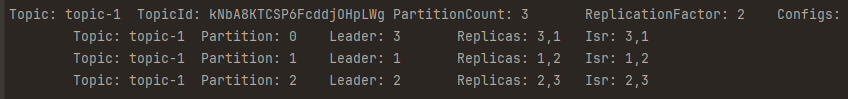

# Поднимаем кластер кафки с несколькими брокерами

В кластере kafka обычно больше 1 брокера которые обычно находятся на разных машинах, тем самым уменьшается вероятность
потери данных,
пропускной способности системы и ее надежности.

## Создаем топик с 3 партициями в кластере

<details>
<summary><b>Создаем топик с 3 партициями в кластере</b></summary>

**Все утилиты kafka лежат в папке /bin**</br>
> [!WARNING]
**Так как ранее мы подняли контейнеры через docker-compose все контейнеры находятся в сети bridge,
имя сети равно имени папки, где лежит файл
docker-compose ([Официальная документация docker на тему](https://docs.docker.com/compose/networking/))
обращение к контейнерам идет по их именам**

Зайти в консоль контейнера с kafka

```shell 
docker exec -it kafka-broker-1 /bin/bash
```

Создать топик с 3 партициями и 1 репликой

```shell 
docker exec -ti kafka-broker-1 /usr/bin/kafka-topics --create --topic topic-1 --partitions 3 --replication-factor 2 --bootstrap-server kafka-broker-1:29091
```

Удалить топик

```shell
docker exec -ti kafka-broker-1 /usr/bin/kafka-topics --delete --topic topic-1 --bootstrap-server kafka-broker-1:29091
```

Список топиков

```shell
docker exec -ti kafka-broker-1 /usr/bin/kafka-topics --list --bootstrap-server kafka-broker-1:29091
```

Описание топиков с партициями</br>
Команда выводит: **Topic** - имя топика, **Partition** - номер партиции,
**Leader** - брокера являющийся лидером, **Replicas** - на каких брокерах хранятся реплики,
**Isr** - на каких брокерах хранятся insync реплики (покажет и Leader
реплику) [Документация conduktor](https://www.conduktor.io/kafka/kafka-topics-cli-tutorial/)
> [!WARNING]
> **Так как в кластере 3 брокера то при создании топика с 3 партициями и 2 репликами произошло следующее:
> по скриншоту ниже видно что, партиция 0 (Partition) имеет лидирующую реплику на брокере 3 (Leader),
> реплики расположены на брокерах 3,1 (Replicas), insync реплики 3,1 (Isr)**
> 

```shell
docker exec -ti kafka-broker-1 /usr/bin/kafka-topics --describe --bootstrap-server kafka-broker-1:29091
```

</details>