# Топики в Kafka

## Топология kafka

Топология которую поддерживает kafka называется Publish/Subscribe (Публикация/Подписка)
<details>
<summary><b>Publish/Subscribe</b></summary>

Применительно к kafka в топологии Publish/Subscribe стоит topic, Producer'ы отправляют сообщения в топики а
Consumer'ы получают сообщения из топиков
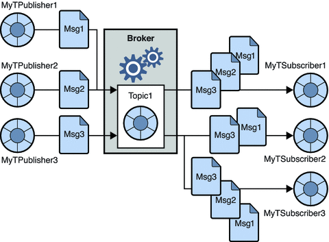</br>
[Картинка с сайта docs.oracle.com](https://docs.oracle.com/cd/E19717-01/819-7759/aerbk/index.html)
</details>

## Топик

### Основные элементы топика

Топик в kafka это некоторый поток данных которому дано имя (под капотом это файл, разделенный на сегменты),
в потоке данных находятся сообщения (record) представляющие собой набор байт.</br>
Логически топик можно представить в виде бесконечной ленты с сообщениями, новые сообщения пишутся в начало ленты,
каждое сообщение имеет некоторый номер смещения относительно начала ленты. (Условно, так как топик делится на
партиции)</br>
**Topic** - имя потока данных</br>
**Record** - сообщение структуры ключ значение </br>
**Offset** - позиция сообщения, для каждой партиции и каждого Consumer'а, есть свой offset, так же у Consumer группы
один offset на всех Consumer'ов в группе!</br>
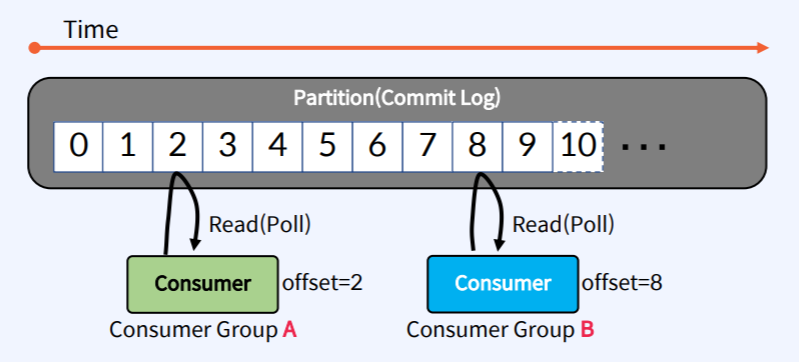</br>

### Задание и изменение параметров топика

Задать параметры топика можно при его создании через командную
строку `kafka-topics.sh --config <String: name=value>`</br>
Динамически изменить параметр топика через утилиту `kafka-configs.sh` (можно менять параметры Consumer'ов, Producer'ов,
Broker'ов):

- --describe - вывести параметры
- --alert --add-config - изменить параметр
- --alert --delete -удалить параметр</br>

Если параметров много, перечислять их в командной строке сложно, можно прописать параметры в файле и указать его при
создании
топика использую ключ `--command-config`.

### Партиции

В теории можно сравнить топик с бесконечной лентой, но на практике все устроено иначе.
Топик делится на partition (раздел) тем самым достигается множество технических целей, например:

- несколько Consumer из одной Consumer группы могут читать из одного топика параллельно, повышается быстродействие
- разные partition одного топика могут располагаться на разных брокерах kafka что дает отказоустойчивость
  </br>
  Partition - это по сути кусочек данных топика
  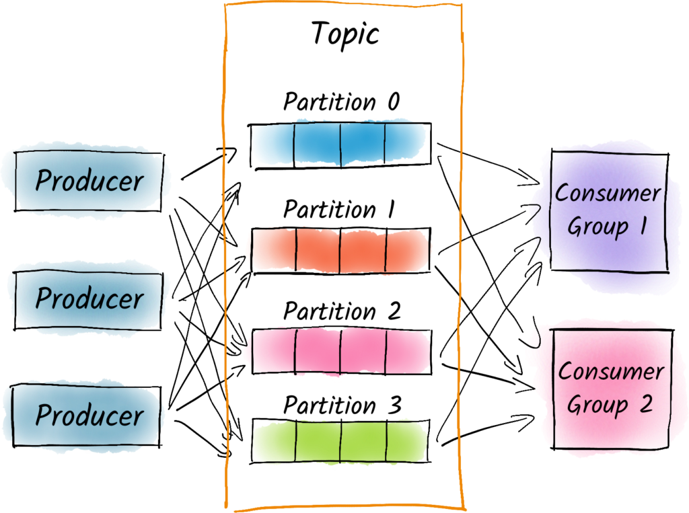</br>

### Операции с топиками

В самой kafka есть скрипт для работы с топиками это `kafka-topics.sh`, основные ключи:

- --list вывести список топиков
- --describe вывести описание топиков с партициями
- --create создать топик
- --delete удалить топик
- --alter изменить топик

### Практика: создание топика

#### Предустановки

> [!IMPORTANT]
> Запустить брокер кафки, выполнить docker-compose

<details>
<summary><b>Создание топика через утилиту kafka-topics</b></summary>

**Все утилиты kafka лежат в папке /bin**</br>
> [!WARNING]
**Так как ранее мы подняли контейнеры через docker-compose все контейнеры находятся в сети bridge,
имя сети равно имени папки, где лежит файл
docker-compose ([Официальная документация docker на тему](https://docs.docker.com/compose/networking/))
обращение к контейнерам идет по их именам**

Зайти в консоль контейнера с kafka

```shell 
docker exec -it kafka-broker-1 /bin/bash
```

Создать топик с параметрами по умолчанию

```shell 
docker exec -ti kafka-broker-1 /usr/bin/kafka-topics --create --topic topic-1 --bootstrap-server kafka-broker-1:29091
```

Изменить существующий топик (должно быть 3 партиции)

```shell
docker exec -ti kafka-broker-1 /usr/bin/kafka-topics --alter --topic topic-1 --partitions 3 --bootstrap-server kafka-broker-1:29091
```

Удалить топик

```shell
docker exec -ti kafka-broker-1 /usr/bin/kafka-topics --delete --topic topic-1 --bootstrap-server kafka-broker-1:29091
```

Список топиков

```shell
docker exec -ti kafka-broker-1 /usr/bin/kafka-topics --list --bootstrap-server kafka-broker-1:29091
```

Описание топиков с партициями</br>
Команда выводит: **Topic** - имя топика, **Partition** - номер партиции,
**Leader** - брокера являющийся лидером, **Replicas** - на каких брокерах хранятся реплики,
**Isr** - на каких брокерах хранятся insync реплики (покажет и Leader
реплику) [Документация conduktor](https://www.conduktor.io/kafka/kafka-topics-cli-tutorial/)

```shell
docker exec -ti kafka-broker-1 /usr/bin/kafka-topics --describe --bootstrap-server kafka-broker-1:29091
```

</details>

## Репликация

Топики могут делиться на партиции для повышения отказоустойчивости и быстродействия партиции одного топика хранятся
на разных брокерах. Для повышения надежность каждая партиция топика может иметь копию, так называемая реплика,
количество реплик для партиции задается параметром `replication-factor`, если брокер с где Leader партиция упадет,
эту партицию заменит ее реплика тем самым уменьшается потеря данных.
> [!WARNING]
> Чтение и запись делаются только в Leader партицию, follower партиции не только копируют то что есть у Leader партиции.
> На картинке replication-factor=3

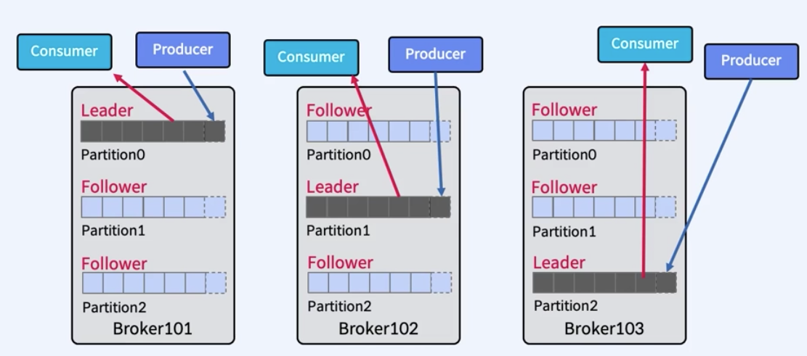</br>

### Практика: репликация топика в кластере

<details>
<summary><b>Отказоустойчивость топика за счет репликаций</b></summary>

Создать топик с 3 партициями и 3 репликами

```shell 
docker exec -ti kafka-broker-1 /usr/bin/kafka-topics --create --topic topic-3 --partitions 3 --replication-factor 3 --bootstrap-server kafka-broker-1:29091
```

Создать топик с 3 партициями и 1 репликой

```shell 
docker exec -ti kafka-broker-1 /usr/bin/kafka-topics --create --topic topic-1 --partitions 3 --bootstrap-server kafka-broker-1:29091
```

Информация о топиках

```shell
docker exec -ti kafka-broker-1 /usr/bin/kafka-topics --describe --bootstrap-server kafka-broker-1:29091
```

Останавливаем kafka-broker-3

```shell
docker stop kafka-broker-3
```

Запустить kafka-broker-3

```shell
docker start kafka-broker-3
```

Удалить топик

```shell
docker exec -ti kafka-broker-1 /usr/bin/kafka-topics --delete --topic topic-3 --bootstrap-server kafka-broker-1:29091
```

Все брокеры работают

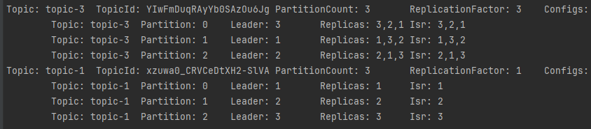</br>

Брокер kafka-broker-3 упал
> [!NOTE]
> Топик topic-3 партиция 0 изменила брокер лидер с 3 на 2 (Follower реплика на брокере 2 стала Leader), хоть брокер 3
> упал но показано что на
> нем хранятся реплики (Replicas), но теперь не показывается что на брокере 3 есть insync реплики (Isr).
>
> [!NOTE]
> Топик topic-1 партиция 2 стала недоступна так как она не мела реплик и была на брокере 3.

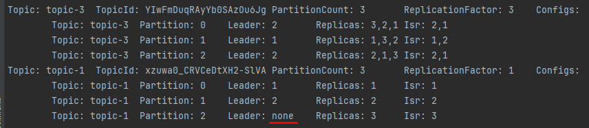</br>

Брокер kafka-broker-3 восстановился
> [!NOTE]
> Для топика topic-3 появились insync реплики на брокере 3 (Replicas),
> партиция 0 не изменила Leader'а (Leader смениться на брокера 3 через настраиваемое время)
>
> [!NOTE]
> Топик topic-1 партиция 2 стала доступна так как брокер 3 доступен

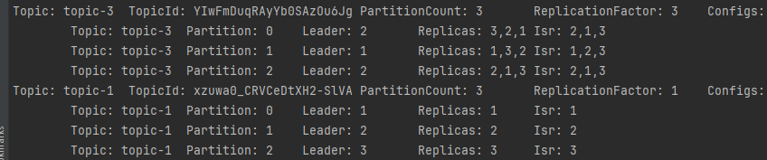</br>
> [!IMPORTANT]
> Через настраиваемое время после восстановления брокера kafka-broker-3, Leader для партиции 0 топика topic-3 вернется
> на брокер 3

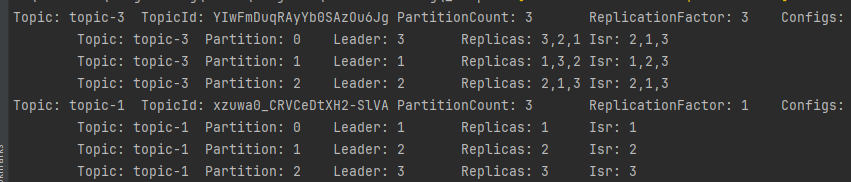</br>

</details>

## Данные в топиках

### Записть данных в топик с партициями

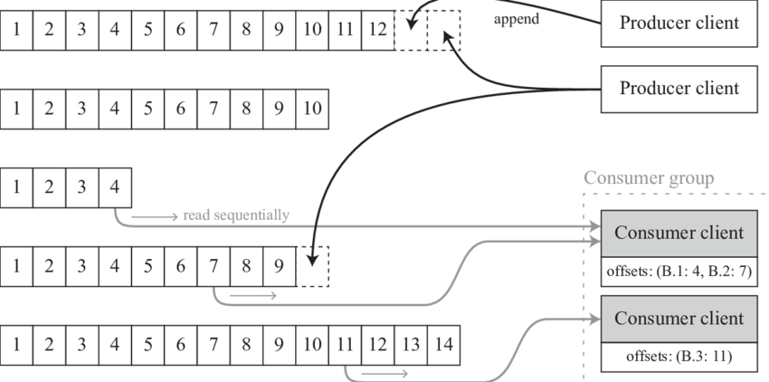</br>

> [!NOTE]
> У каждой связки партиция плюс потребитель (Partition + Consumer) свой Offset

> [!IMPORTANT]
> Offset постоянно увеличивается и имеет максимальное значение int64, при достижении максимального значения
> offset сбросится на начало, но при записи 1ТБ данных в день нужно 4 миллиарда дней, чтобы переполнить offset,
> так же у каждой партиции свой offset соответственно offset на 99.999% никогда не переполнится.

> [!IMPORTANT]
> Порядок сообщений гарантирован только в рамках одной партиции, в рамках топика он не гарантирован.
> Распределение сообщения по партициям происходит по взятию hash функции от байтового представления ключа сообщения,
> если ключ есть, если ключа нет то распределение происходит случайным образом.
> При работе с kafka на можно реализовать свой класс партиционирования тем самым создав свою стратегию
> распределения сообщений по партициям.

### Физическое представление данных в топиках

Данные в kafka хранятся в файлах журналах (.log файлах), физически файлы журналов делятся на сегменты,
сегмент это некоторый набор файлов.

Часть картинок взята из видео [Про Kafka (основы)][Про Kafka (основы)]

> [!NOTE]
> - log.dir - место хранения журналов
> - подкаталог - это топик
> - количество подкаталогов - равно количеству партиций
> - формат названия - имя-топика_номер-партиции</br>
    > Пример: /logs, /logs/topicA_0; /logs/topicB_0; /logs/topicB_1

<details>
<summary><b>log файлы</b></summary>

**Структура каталога ./logs**</br>
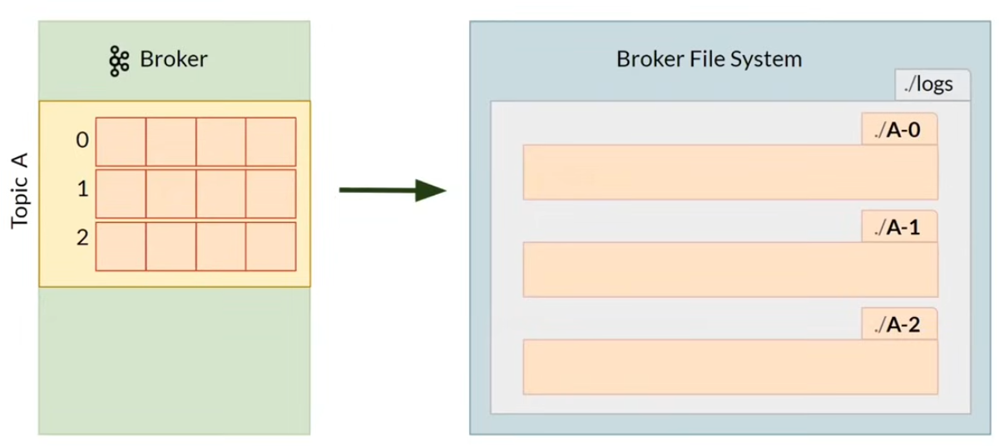</br>

**Структура каталога партиции 0 топика А ./logs**</br>
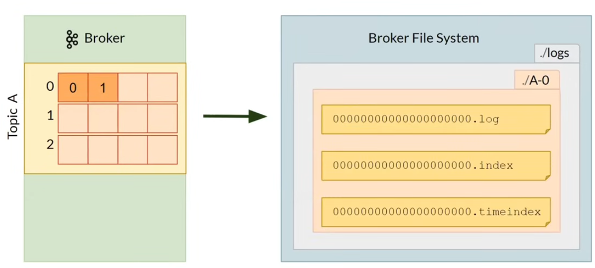</br>

**Файл \*.log хранит непосредственно данные самих сообщений**</br>
В фале \*.log есть:</br>

- Offset - смещение для сообщения в партиции
- Position - смещение начала сообщения в файле в байтах
- Timestamp - время записи сообщения в файл
- Message - непосредственно переданное сообщение </br>

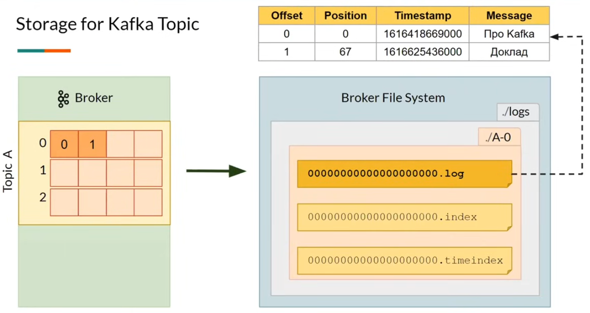</br>

**Файл \*.index хранит маппинг Offset'а на позицию сообщения в файле**</br>
Если мы хотим прочитать сообщение с Offset 1 то в .log файле нужно начать его читать с 67 байта</br>
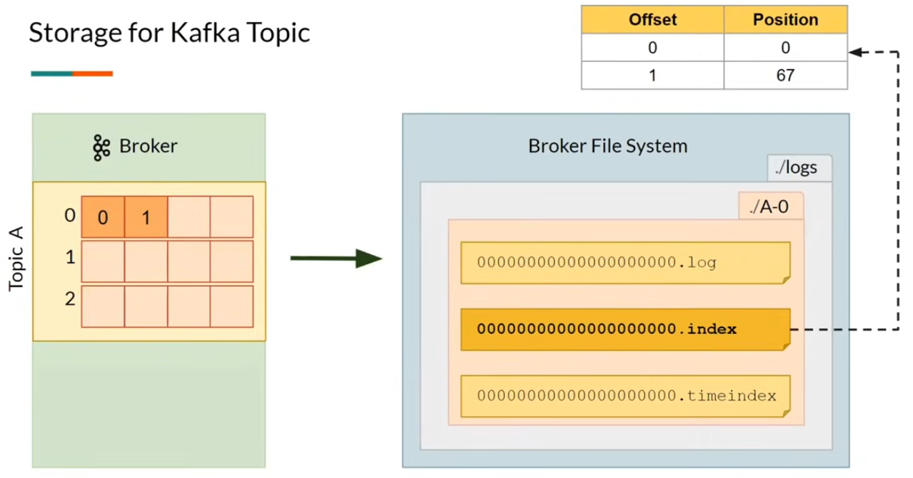</br>

**Файл \*.timeindex хранит маппинг Offset'а на Taimstamp**</br>
Если необходимо прочитать сообщения начиная с какого-то времени то ближайший Timestamp который есть в
файле .timeindex к необходимому времени будет найден и против него возьмется Offset, для Offset'а
возьмется Position и сообщения начиная с этого смещения в байтах в .log файле начнут читаться</br>
> [!IMPORTANT]
> Если Timestamp на Producer'е при отправке сообщения будет выставлен рандомный то в одном .log файле могут
> быть сообщения совершенно с разным timestampом, а порядка по timestamp нет, соответственно Product может
> отправить сообщение с timestamp который может быть мень чем у предыдущего, хотя по timestamp такое сообщение
> должно было быть раньше!

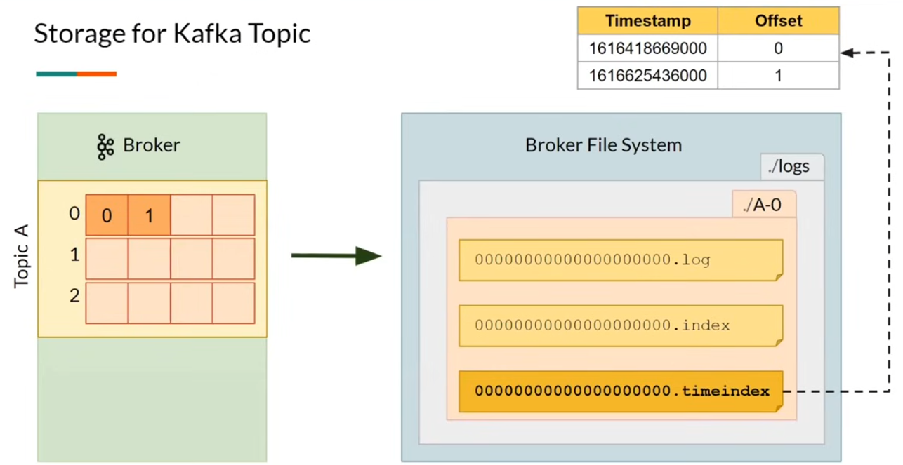</br>
</details>

<details>
<summary><b>Сегменты</b></summary>

.log файл имеет ограничение размера, по умолчанию 1ГБ, при превышении лимита текущий .log файл "закрывается" и
создается новый .log файл (**новый сегмент**).
Сегментация необходима для повышения производительности, с большим файлом в котором хранятся все данные работать
медленно.
> [!IMPORTANT]
> - Последний .log файл является активным
> - Имя сегмента заканчивается номером Offset'а первого сообщения находящегося в этом .log файле
> - сегмент так же имеет свой timestamp
> - Старый сегмент становится архивным, когда архивный сегмент содержит только сообщения которые должны быть
    > удалены архивный сегмент удалиться

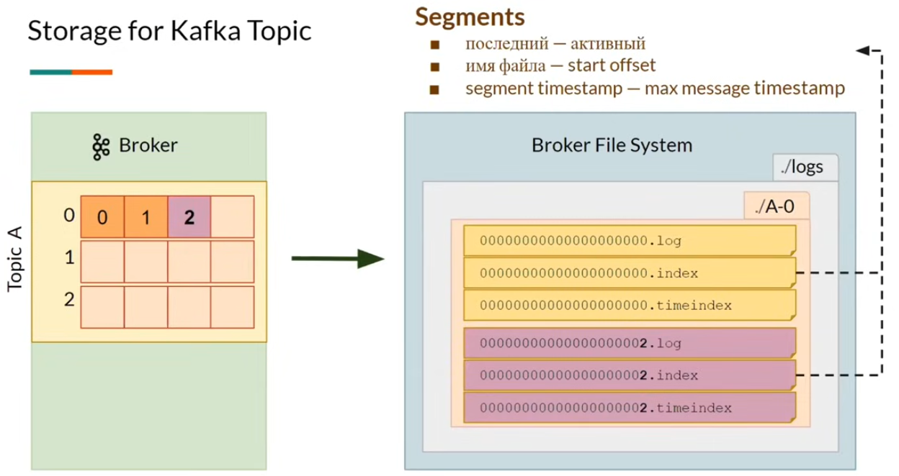</br>
</details>

<details>
<summary><b>Операции с журналами</b></summary>

- kafka-log-dirs.sh - информация о журналах
- kafka-get-offsets.sh - информация о смещениях
- kafka-dump-log.sh - просмотр содержимого журналов
- kafka-delete-records.sh - удаление записей

</details>

<details>
<summary><b>Параметры хранения сообщений</b></summary>

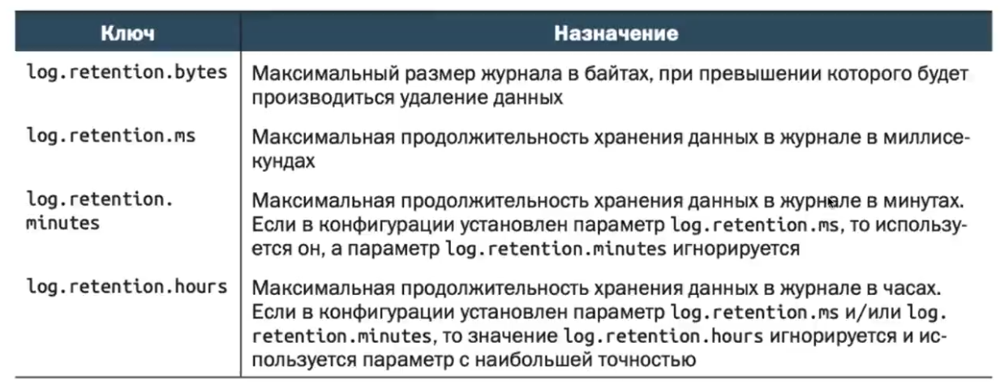</br>
</details>

### Практика: физическое хранение сообщений

<details>
<summary><b>Физическое хранение сообщений в kafka</b></summary>

Создаем топик продюсируем сообщение в топик, смотрим на какой брокер попал топик,
заходим в данный брокер в директиву контейнера `var/lib/kafka/data` и видим там файлы .log.</br>
> [!IMPORTANT]
> По умолчанию расположение .log файлов указано в файле server.properties в директории `etc/kafka/`

Создать топик с параметрами по умолчанию

```shell 
docker exec -ti kafka-broker-1 /usr/bin/kafka-topics --create --topic topic-1 --bootstrap-server kafka-broker-1:29091
```

Отправить в топик сообщение с ключом, формат - Key:Value

```shell
docker exec -ti kafka-broker-1 /usr/bin/kafka-console-producer --bootstrap-server kafka-broker-1:29091 --topic topic-1  --property "parse.key=true" --property "key.separator=:"
```

Информация о журнале в топике

```shell
docker exec -ti kafka-broker-1 /usr/bin/kafka-log-dirs --bootstrap-server kafka-broker-1:29091 --topic-list topic-1 --describe
```

Информация о топике

```shell
docker exec -ti kafka-broker-1 /usr/bin/kafka-topics --describe --topic topic-1 --bootstrap-server kafka-broker-1:29091
```

Зайти в консоль контейнера с kafka

```shell 
docker exec -it kafka-broker-3 /bin/bash
```

Удалить топик

```shell
docker exec -ti kafka-broker-1 /usr/bin/kafka-topics --delete --topic topic-3 --bootstrap-server kafka-broker-1:29091
```

**Результат**
Было отправлено сообщение value1 с ключом key1, видим что в файле ...0.log присутствует наше сообщение и ключ

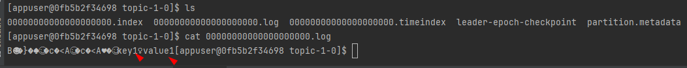</br>
</details>

<details>
<summary><b>Распределение сообщений без ключа</b></summary>
В теории распределение сообщений без ключа должно быть по случайным партициям, но если сообщения очень маленькие
то они могут попасть в одну партицию.

Создать топик с 3 партициями и 1 репликой

```shell 
docker exec -ti kafka-broker-1 /usr/bin/kafka-topics --create --topic topic-3 --partitions 3 --bootstrap-server kafka-broker-1:29091
```

Информация о топиках

```shell
docker exec -ti kafka-broker-1 /usr/bin/kafka-topics --describe --bootstrap-server kafka-broker-1:29091
```

Зайти в консоль контейнера с kafka

```shell 
docker exec -it kafka-broker-3 /bin/bash
```

Отправить 100 мелких сообщений

```shell
docker exec -ti kafka-broker-1 /usr/bin/kafka-producer-perf-test --topic topic-3 --num-records 100 --record-size 10 --throughput -1 --producer-props bootstrap.servers=kafka-1:29091,kafka-2:29092,kafka-3:29093
```

Информация о смещении

```shell
docker exec -ti kafka-broker-1 /usr/bin/kafka-get-offsets --topic topic-3 --bootstrap-server kafka-broker-1:29091
```

> [!IMPORTANT]
> Как видим все 100 сообщений попали в одну партицию, из-за того что они маленького размера</br>

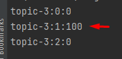</br>

Отправить 100 крупных сообщений

```shell
docker exec -ti kafka-broker-1 /usr/bin/kafka-producer-perf-test --topic topic-3 --num-records 100 --record-size 1500 --throughput -1 --producer-props bootstrap.servers=kafka-1:29091,kafka-2:29092,kafka-3:29093
```

> [!IMPORTANT]
> Как видим теперь сообщения распредилились по всем 3 партициям

Посмотреть информацию о файле журнала, необходимо указать брокера где лежит файл!

```shell
docker exec -ti kafka-broker-3 /usr/bin/kafka-dump-log --files /var/lib/kafka/data/topic-1-0/00000000000000000000.log
```

Посмотреть данные в файле журнала, необходимо указать брокера где лежит файл!

```shell
docker exec -ti kafka-broker-3 /usr/bin/kafka-dump-log --print-data-log --files /var/lib/kafka/data/topic-1-0/00000000000000000000.log
```

Удалить топик

```shell
docker exec -ti kafka-broker-3 /usr/bin/kafka-topics --delete --topic topic-3 --bootstrap-server kafka-broker-1:29091
```

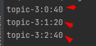</br>
</details>

<details>
<summary><b>Удаление сообщений из топика</b></summary>

> [!IMPORTANT]
> Для удаления используется утилита `kafka-delete-records`
> Для удаления сообщений необходим .json файл с полями: topic, partition, offset, version.
> Удалив сообщения из топика Offset останется неизменным!
</details>

## Сжатие топиков

Существует две стратегии хранения сообщений в топиках (сегментах):

- delete - удаление сообщений, удовлетворяющих условиям
- compact - сохранение только последних значений для каждого ключа

> [!IMPORTANT]
> Сжатие (compact) возможно только для тем с не пустыми ключами!
> Сжимаются только не активные сегменты!
> По умолчанию сжатие начинается когда топик содержит 50% "грязных" данных

Параметры сжатия:

- min.compaction.lag.ms - минимальная задержка после записи сообщения до его сжатия
- max.compaction.lag.ms - максимальная задержка между моментом записи сообщения и моментом, когда оно пригодно для
  сжатия

Параметры определяющие стратегию хранения сообщений и другие:

- cleanup.policy - вид механизма хранения не актуальных сообщений (delete, compact). При значении compact сообщения
  топика будут отбрасываться и из сообщений с заданным ключом будет сохраняться только самое последнее (сжатие журнала)
- retention.bytes - определяет размер партиции, после превышения которого следует начать удалять сообщения
- retention.ms – определяет максимальный возраст сообщения, после превышения которого следует его удалить
- compression.type - тип сжатия, используемый брокером при записи на диск пакетов сообщений для данного топика
- delete.retention.ms - длительность (в миллисекундах) хранения отметок об удалении для данного топика. Имеет смысл
- file.delete.delay.ms - длительность (в миллисекундах) ожидания перед удалением сегментов журнала и индексов для
  данного
  топика с диска
- flush.messages - количество сообщений, которое может быть получено, прежде чем будет выполнен принудительный сброс
  сообщений
  данного топика на диск
- flush.ms - промежуток времени (в миллисекундах) перед принудительным сбросом сообщений данного топика на диск
- max.compaction.lag.ms - максимальное время, в течение которого сообщение не будет сжиматься в журнале
- max.message.bytes - максимальные размер отдельного сообщения данного топика в байтах
  только для топиков со сжатием журналов
- min.cleanable.dirty.ratio - частота попыток сжатия разделов данного топика утилитой сжатия журналов (в виде отношения
  числа
  несжатых сегментов журнала к общему числу сегментов). Имеет смысл только для топиков со сжатием журналов
- min.insync.replicas - минимальное число согласованных реплик, необходимое для того, чтобы раздел топика считался
  доступным
- retention.bytes - объем хранимых сообщений этого топика в байтах
- retention.ms - длительность в миллисекундах хранения сообщений данного топика
- segment.bytes - объем сообщений в байтах, записываемый в отдельный сегмент журнала в разделе
- segment.index.bytes - максимальный размер в байтах отдельного индекса сегмента журнала

Фоновый процесс выполняет процедуру сжатия для сегментов.</br>
Сжатие выполняется в хвосте (Tail или ее еще называют чистая), новые записи попадают в голову
(Head или ее еще называют грязная) голова не сжимается. В Tail ключи идут не по порядку так как некоторые из них
сжаты</br>
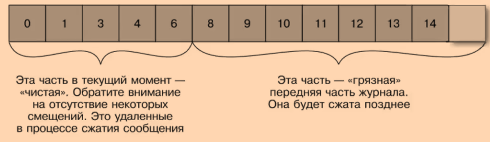</br>
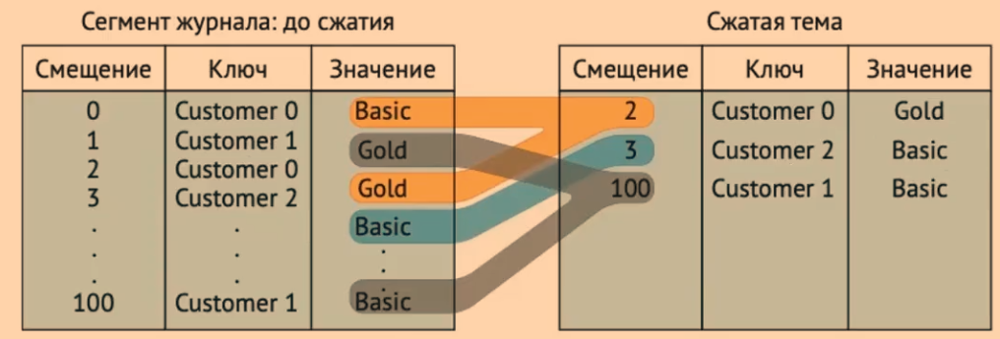</br>
Для удаления записи можно передать ключ записи которой необходимо передать со значением null,
какое то время после сжатия запись где value равен null проживет, после будет удалена</br>
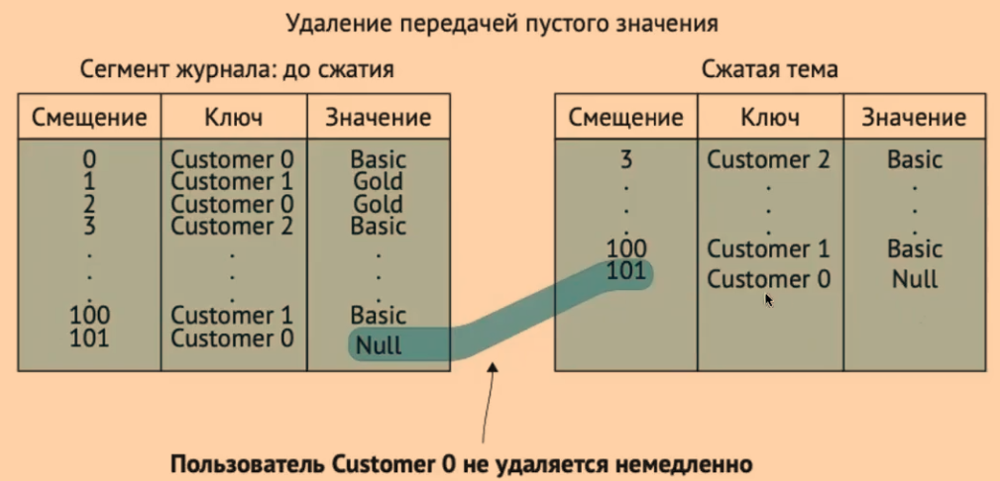</br>

Cтатьи с пояснением работы compact:

- [habr][PVbase: compacted topic в Apache Kafka]
- [confluent][Confluent Topic Compaction]

[Про Kafka (основы)]:https://www.youtube.com/watch?v=-AZOi3kP9Js&t=2174s&ab_channel=%D0%92%D0%BB%D0%B0%D0%B4%D0%B8%D0%BC%D0%B8%D1%80%D0%91%D0%BE%D0%B3%D0%B4%D0%B0%D0%BD%D0%BE%D0%B2%D1%81%D0%BA%D0%B8%D0%B9

[PVbase: compacted topic в Apache Kafka]:https://habr.com/ru/companies/sberbank/articles/590045/

[Confluent Topic Compaction]:https://developer.confluent.io/courses/architecture/compaction/